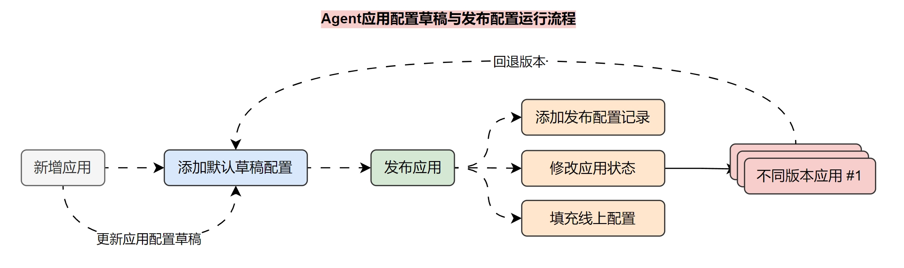
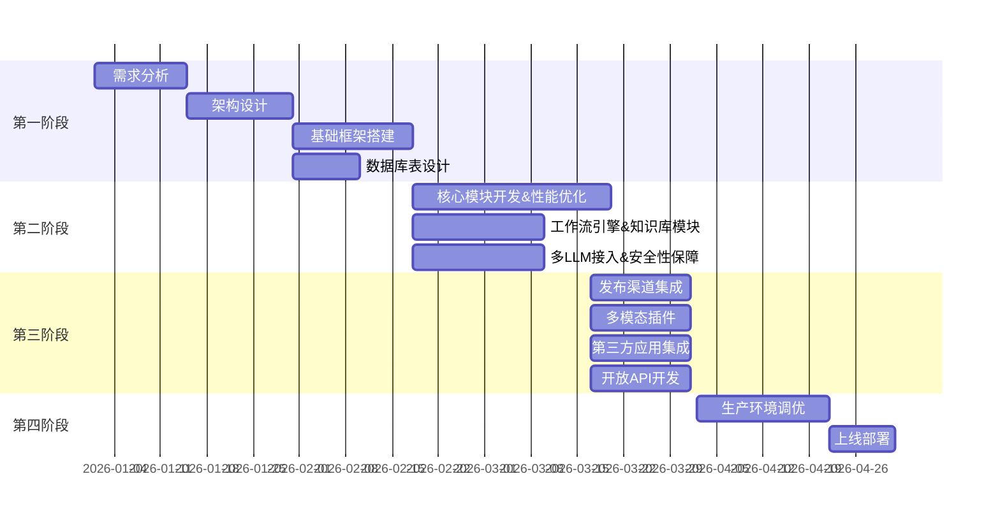

<h1 align="center">Aether LLMOps 原生AI 应用开发平台</h1>


## Aether LLMOps 项目服务架构设计

在整个Aether LLMOps项目中，我使用了多个服务，具体如下：

1. API：基于`Flask`和`LangChain`搭建的 `LLMOps API` 服务。
2. Web：基于`Vue.js`搭建的 `LLMOps`前端服务，一个静态`html`文件服务。
3. 数据库：`Postgres`数据库，用于存储`LLMOps`项目的数据信息。
4. 缓存：`Redis`缓存数据库，用于存储`Embeddings`缓存、`Celery`消息代理等信息。
5. 向量数据库：`Weaviate`向量数据库，用于存储`Embeddings`向量。
6. 任务队列：`Celery`任务队列，用于执行异步任务。
7. Nginx反向代理：反向代理连接`API`和`WEB`服务，实现域名访问 `LLMOps` 项目。

为了便于部署和管理，我将这些服务部署到`Docker`容器中，并使用`docker-compose`管理多个容
器，同时通过 `Nginx` 进行反向代理，连接 `API` 和 `web` 服务，项目整体服务架构设计图如下：


## 项目后端模块设计

该项目采用经典的分层架构设计

1. 入口层 app/http/ 负责应用初始化和中间件注册
2. 路由层 handler/ 负责接收请求和参数校验
3. 业务层 service/ 实现核心业务逻辑
4. 数据层 model/ 负责数据库交互
5. 公共组件 pkg/ 提供跨模块复用的通用能力
6. 配置和工具模块分离，便于维护和扩展

核心引擎层`internal/core/`：

- workflow/ - 完整的工作流引擎，支持多种节点类型（LLM、工具调用、HTTP请求、代码执行等）
- language_model/ - LLM 抽象封装
- embedding/ - 文本向量化
- vector_store/ - 向量数据库管理
- unstructured/ - 非结构化文档解析
- tool/ - 内置工具集
- memory/ - 对话上下文记忆

### API 项目文件结构梳理（更新版）：

---

```
api/
├── config/                     # 配置模块
│   ├── __init__.py
│   ├── config.py               # 配置加载逻辑
│   └── default_config.py       # 默认配置项
├── app/                        # 应用入口层
│   ├── __init__.py
│   └── http/                   # HTTP服务入口
│       ├── __init__.py
│       ├── app.py              # FastAPI 应用实例创建、中间件注册
│       └── module.py           # 依赖注入模块配置
├── internal/                   # 核心业务实现层
│   ├── core/                   # 核心组件（工作流、向量存储、文档处理等）
│   │   ├── embedding/          # 文本嵌入模型封装
│   │   ├── language_model/     # LLM 调用封装
│   │   ├── memory/             # 对话记忆管理
│   │   ├── tool/               # 内置工具实现
│   │   ├── unstructured/       # 非结构化文档处理（含 nltk_data）
│   │   ├── vector_store/       # 向量数据库存储（index.faiss、index.pkl）
│   │   └── workflow/           # 工作流引擎核心
│   │       ├── entities/       # 工作流实体定义（节点、边、变量）
│   │       ├── nodes/          # 工作流节点类型实现
│   │       │   ├── start/      # 开始节点
│   │       │   ├── end/        # 结束节点
│   │       │   ├── llm/        # LLM 调用节点
│   │       │   ├── code/       # 代码执行节点
│   │       │   ├── tool/       # 工具调用节点
│   │       │   ├── http_request/  # HTTP 请求节点
│   │       │   ├── dataset_retrieval/  # 数据集检索节点
│   │       │   ├── template_transform/  # 模板转换节点
│   │       │   ├── question_classifier/  # 问题分类节点
│   │       │   └── iteration/  # 循环迭代节点
│   │       ├── utils/          # 工作流工具函数
│   │       └── workflow.py     # 工作流引擎主逻辑
│   ├── entity/                 # 实体定义
│   ├── exception/              # 自定义异常定义
│   ├── extension/              # 扩展模块
│   ├── handler/                # API 接口处理器（Controller层）
│   ├── lib/                    # 内部工具库
│   ├── middleware/             # HTTP 中间件
│   ├── migration/              # 数据库迁移（Alembic）
│   ├── model/                  # 数据库模型（DAO层）
│   ├── router/                 # 路由配置
│   ├── schema/                 # 请求/响应模型（Pydantic）
│   ├── server/                 # 服务启动配置
│   ├── service/                # 业务逻辑层（Service层）
│   └── task/                   # 异步任务模块
├── pkg/                        # 公共可复用组件
├── storage/                    # 存储相关模块
├── test/                       # 单元测试/集成测试
├── Dockerfile
├── requirements.txt
└── ...
`internal/core/` 是项目的核心引擎层，包含：
```

## 快速开始

填写`docker-compose.yml`文件中的环境变量，包括数据库连接信息、缓存数据库连接信息、向量数据库连接信息，各种API密钥等。

```bash
cd docker
docker-compose up -d
```

## 应用编排模块

在 LLMOps 应用编排页面，应用的配置可以划分成几种，例如：

- 草稿配置：用户在前端编排页面修改`Agent`配置时，实时存储的就是 草稿配置，草稿配置只会在 编排页面 调试中生效，在开放`API` 或者 `WebApp` 中均不会起效果。
- 当前发布的运行配置：即当前 Agent 智能体在开放 `API` 或者在 `WebApp` 中使用的配置信息，由 草稿配置 发布得到。
- 历史发布的运行配置：记录每一次发布的运行配置，便于在编排页面对配置进行 回退操作，当执行回退操作时会将对应的运行配置同步到草稿配置中，完成对 草稿配置 的覆盖。



在 LLMOps 项目中，考虑使用两张表来完成该运行流程，这两张表分别是：

1. app_config：应用运行配置表，用于存储该 `Agent` 应用实际运行的配置信息（`WebApp`、开放 `API` 运行的 Agent 配置）。
2. app_config_version：应用配置历史版本表，该表用于存储每次发布的配置信息历史+草稿信息，通过 `config_type` 来标识记录是 历史配置 还是草稿，通过 `version` 字段来标识不同的版本。

那么不同的操作执行的逻辑如下：

1. 创建应用：创建应用的同时添加 app_config_version 记录，并在记录中存储 默认草稿配置信息。
2. 更新应用草稿配置：将数据同步到 app_config_version 的草稿配置记录中。
3. 发布应用：取出应用的 app_config_version 草稿配置，同步添加到 app_config 中，同时在app_config_version 中添加一个历史配置信息记录，并更改应用的状态，从而完成发布应用流程。
4. 更新应用：取出应用的 app_config_version 草稿配置，并同步更新 app_config 中的配置，同时在app_config_version 中添加一条历史配置信息记录，从而完成应用更新流程。
5. 取消发布：删除 app_config 中的配置，并更改应用的状态。

## 知识库模块

### 一些优化点

- 考虑到处理大量文档分块、嵌入等的长耗时，利用 Celery+Redis 构建异步任务队列处理分块嵌入，用线程池优化向量入库。
- 随着功能迭代，针对检索准确率不够，在 RAG 引入检索前处理+混合检索+重排，在黑神话悟空的自建QA数据下测试，准确率相比语义检索提升近30%，召回率从60%左右提升至80%+。
- 在文档与片段(chunk)的更新与删除时，实现 Redis 缓存锁，保障数据安全。

### 检索器设计思路

- 在全文检索时，项目考虑的是第一种方案，增删改都要将数据同步到关键词表中，简化全文检索的实现。
- 第二种方法，本项目并未使用，因为其在全文检索时，需要将所有 doc 和 seg 都遍历一遍再过滤，导致查询效率低。


## 流式输出

考虑在`LLMOps`项目中，借用`队列(Queue)+线程(Thread)`的方式来重新实现流式输出这个逻辑，思路如下：

构建一个 队列(Queue)，用于存储数据，队列的数据先进先出，并且是线程安全的，非常适合用于开发。
在`LangGraph`构建的节点(nodes)中，所有代码都使用`stream()` 代替`invoke()`，获取数据的时候，将数据添加到队列(Queue) 中。
创建一条线程，专门用于执行`LangGraph`图程序，这样不影响主线程。
在主线程监听队列(Queue)里的数据，并逐个取出，然后进行流式事件响应输出，直到取到结果为`None`结束请求。
基于该思想，在`LLMOps`项目中实现`流式事件响应 + 块内容响应`的两种输出响应运行流程如下：


## 项目时间节点



## 附录

### 术语表

| 术语 | 定义                                            |
| ---- | ----------------------------------------------- |
| LLM  | Large Language Model，大语言模型                |
| RAG  | Retrieval-Augmented Generation，检索增强生成    |
| API  | Application Programming Interface，应用程序接口 |

## 贡献

贡献是使开源社区成为学习、激励和创造的惊人之处。非常感谢您所做的任何贡献。如果您有任何建议或功能请求，请先开启一个议题讨论您想要改变的内容。

## 许可证

该项目根据 Apache-2.0 许可证的条款进行许可。详情请参见[LICENSE](LICENSE)文件。
