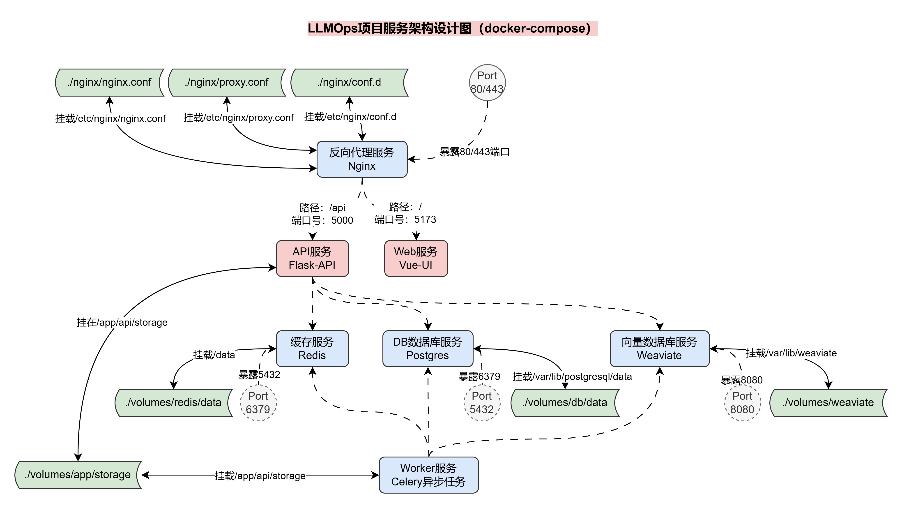
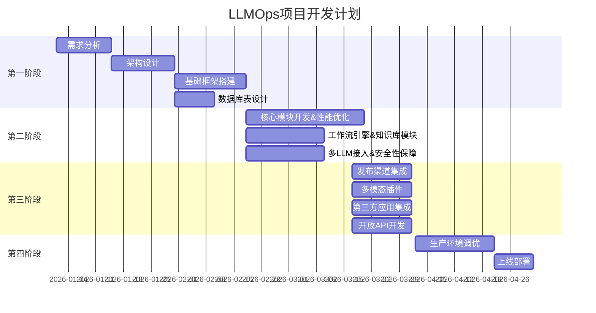

<h1 align="center">Aether LLMOps 原生AI 应用开发平台</h1>


## Aether LLMOps 项目服务架构设计

在整个Aether LLMOps项目中，我使用了多个服务，具体如下：

1. API：基于`Flask`和`LangChain`搭建的 `LLMOps API` 服务。
2. Web：基于`Vue.js`搭建的 `LLMOps`前端服务，一个静态`html`文件服务。
3. 数据库：`Postgres`数据库，用于存储`LLMOps`项目的数据信息。
4. 缓存：`Redis`缓存数据库，用于存储`Embeddings`缓存、`Celery`消息代理等信息。
5. 向量数据库：`Weaviate`向量数据库，用于存储`Embeddings`向量。
6. 任务队列：`Celery`任务队列，用于执行异步任务。
7. Nginx反向代理：反向代理连接`API`和`WEB`服务，实现域名访问 `LLMOps` 项目。

为了便于部署和管理，我将这些服务部署到`Docker`容器中，并使用`docker-compose`管理多个容
器，同时通过 `Nginx` 进行反向代理，连接 `API` 和 `web` 服务，项目整体服务架构设计图如下：



## 快速开始

```bash
cd docker
docker-compose up -d
```

## 项目时间节点



## 附录

### 术语表

| 术语 | 定义                                            |
| ---- | ----------------------------------------------- |
| LLM  | Large Language Model，大语言模型                |
| RAG  | Retrieval-Augmented Generation，检索增强生成    |
| API  | Application Programming Interface，应用程序接口 |
| QPS  | Queries Per Second，每秒查询率                  |
| P99  | 99%的请求响应时间                               |
