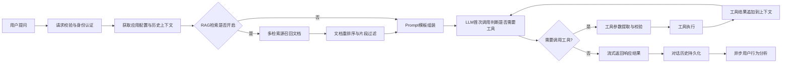

# LLMOps 后端架构设计全面复盘

## 一、整体架构设计

### 1. 架构分层结构

该LLMOps平台采用经典的MVC分层架构，结合领域驱动设计思想，整体分为7个核心层级：

```
┌─────────────────────────────────────────────────────┐
│  接入层 (Server Layer)                               │
│  - HTTP服务引擎、中间件、路由注册、跨域处理               │
├─────────────────────────────────────────────────────┤
│  接口层 (Handler Layer)                              │
│  - 20+业务模块控制器、请求参数校验、响应封装              │
├─────────────────────────────────────────────────────┤
│  服务层 (Service Layer)                              │
│  - 业务逻辑编排、事务控制、多组件协同                     │
├─────────────────────────────────────────────────────┤
│  核心能力层 (Core Layer)                              │
│  - LLM引擎、RAG检索引擎、Agent执行引擎、工作流引擎        │
│  - 工具体系、知识库处理、向量存储、内存管理                │
├─────────────────────────────────────────────────────┤
│  数据模型层 (Model/Entity/Schema Layer)               │
│  - ORM模型、数据实体、请求/响应校验Schema                │
├─────────────────────────────────────────────────────┤
│  扩展层 (Extension Layer)                            │
│  - 数据库、向量库、缓存、消息队列、日志等扩展              │
├─────────────────────────────────────────────────────┤
│  公共组件层 (Lib/Pkg Layer)                           │
│  - 工具类、响应封装、分页器、异常定义等公共能力            │
└─────────────────────────────────────────────────────┘
```

### 2. 核心模块划分

#### 业务模块

- **应用管理模块**：Agent应用的创建、配置、发布、调试、版本管理
- **知识库模块**：数据集管理、文档上传解析、分段处理、向量检索
- **工具管理模块**：内置工具、自定义API工具、OpenAPI schema校验
- **工作流模块**：可视化流程编排、节点执行、流程调度
- **模型管理模块**：多LLM提供商适配、模型参数配置、调用管理
- **会话管理模块**：对话历史、记忆管理、调试会话
- **账号权限模块**：用户认证、授权、API Key管理

#### 核心能力模块

| 模块                    | 核心能力                      |
| --------------------- | ------------------------- |
| `core/language_model` | 多LLM提供商统一抽象、流式响应、错误重试     |
| `core/retrievers`     | 语义检索、全文检索、混合检索、重排序        |
| `core/agent`          | Agent执行调度、工具调用、思维链处理      |
| `core/tools`          | 10+内置工具、自定义工具动态加载、参数校验    |
| `core/vector_store`   | Weaviate向量库封装、向量CRUD、检索优化 |
| `core/file_extractor` | 20+文件格式解析、结构化输出、OCR支持     |
| `core/workflow`       | 工作流引擎、节点执行、分支判断、异步调度      |

### 3. 组件协同关系

采用依赖注入设计模式，所有组件通过injector容器自动注入，依赖关系清晰：

- 路由层自动注入所有Handler实例
- Handler层自动注入所需Service和核心组件实例
- Service层自动注入Model、核心能力组件和外部扩展
- 所有组件无硬编码依赖，便于单元测试和替换

## 二、主要业务逻辑实现细节

### 1. Agent应用开发流程实现

```
创建应用 → 配置应用信息 → 配置prompt/模型/工具/知识库 → 保存草稿 → 调试 → 发布上线
```

- **版本管理机制**：草稿配置与发布配置分离，支持版本历史回滚，每次发布生成新版本记录
- **调试隔离**：提供独立的调试会话环境，不影响线上运行版本
- **发布审核**：支持发布/取消发布操作，线上灰度切换零 downtime

### 2. RAG知识库处理实现

```
创建数据集 → 上传文档 → 文档解析 → 文本分段 → 向量化 → 存储到向量库 → 检索测试
```

- **文档解析**：支持PDF/Word/Excel/PPT/Markdown/图片等20+格式，自动提取文本内容
- **智能分段**：基于语义相似度+长度阈值的分段策略，保留上下文完整性
- **混合检索**：语义检索+全文检索+关键词匹配的多召回源融合，支持自定义权重
- **向量存储**：基于Weaviate向量数据库，支持多租户隔离、元数据过滤

### 3. 对话执行流程实现

```
用户提问 → 上下文组装 → RAG检索 → prompt构建 → LLM调用 → 工具调用判断 → 工具执行 → 结果组装 → 响应输出
```

- **流式响应**：全链路支持SSE流式输出，打字机效果优化用户体验
- **记忆管理**：短期记忆存储会话历史，长期记忆自动提取对话摘要
- **工具调用**：自动判断是否需要调用工具，支持多轮工具调用和结果整合
- **错误处理**：调用失败自动重试，异常情况友好降级，不阻断用户对话

### 4. 工具体系实现

- **内置工具**：Wikipedia搜索、DALL-E3画图、高德天气、谷歌搜索、PPT生成等10+内置工具
- **自定义工具**：支持导入OpenAPI schema自动生成工具，动态加载无需重启
- **工具沙箱**：工具执行环境隔离，敏感操作权限控制，防止恶意调用
- **参数校验**：自动校验工具入参格式，参数错误自动提示LLM修正

## 三、系统运行时数据流通路径

### 1. HTTP请求处理全链路

```
用户请求 → Nginx → Flask服务 → 中间件(身份认证/日志/限流) → 路由匹配 → Handler参数校验 → Service业务处理 → 核心组件调用 → 数据库/向量库操作 → 响应封装 → 返回给用户
```

### 2. 对话请求数据流



### 3. 知识库处理数据流

```
上传文档 → 异步任务队列 → 格式识别 → 文件解析提取文本 → 文本清洗与预处理 → 智能分段 → 调用Embedding模型生成向量 → 写入向量库与关系数据库 → 通知用户处理完成
```

- 所有文档处理操作异步执行，不阻塞前端请求
- 支持批量文档上传与并行处理
- 处理状态实时可查，失败任务支持重试

## 四、架构设计优势与潜在改进点

### 1. 架构优势

1. **高度模块化设计**：核心能力与业务逻辑完全分离，组件可复用性强，新增功能迭代效率高
2. **依赖注入解耦**：所有组件通过DI容器管理，无硬编码依赖，单元测试成本极低，便于组件替换升级
3. **分层清晰职责单一**：每层职责明确，边界清晰，符合开闭原则，便于维护和扩展
4. **异步解耦**：耗时操作全部通过Celery异步队列处理，系统吞吐量高，用户体验好
5. **多租户支持**：数据层面天然支持多租户隔离，适合SaaS化部署
6. **开发友好**：统一的异常处理、参数校验、响应封装，开发规范统一，新人上手快
7. **技术栈成熟**：基于Flask生态，技术栈成熟稳定，社区资源丰富，运维成本低

### 2. 潜在改进点

1. **性能优化**：
   - 核心路径增加缓存层，减少重复计算和数据库查询
   - 向量检索性能优化，支持大规模知识库秒级检索
   - 批量操作接口优化，减少IO次数
2. **可观测性增强**：
   - 增加全链路追踪，可排查每个请求的耗时瓶颈
   - 完善LLM调用监控，统计token消耗、成功率、延迟等指标
   - 增加业务指标埋点，便于产品迭代决策
3. **高可用增强**：
   - 核心模块增加降级熔断机制，防止单个组件故障影响全链路
   - 增加流量控制和限流策略，防止突发流量打垮服务
   - 多集群部署支持，实现异地多活
4. **扩展性优化**：
   - 核心能力层进一步抽象，支持插件化扩展，便于第三方开发者贡献能力
   - 增加事件驱动架构，模块间通过事件通信，进一步解耦
   - 支持Serverless部署模式，降低冷启动成本
5. **安全性增强**：
   - 增加敏感数据检测与过滤，防止prompt注入和敏感信息泄露
   - 工具调用权限精细化控制，支持按用户/应用分配工具使用权限
   - 所有外部调用增加审计日志，可追溯可回查

### 3. 总结

该LLMOps平台架构设计整体非常成熟，符合企业级应用开发规范，模块化程度高，扩展性好，能够支撑从0到1的LLM应用开发全流程。当前架构已经能够支撑中小规模的用户量和业务量，经过上述优化后，可以支撑大规模商业化落地。
