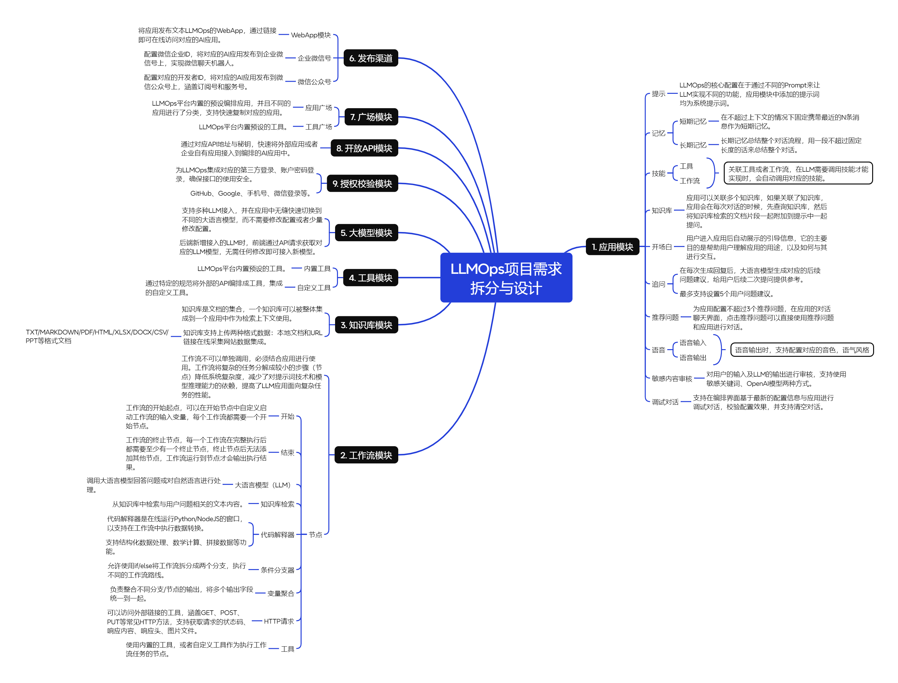

# LLMOps 项目需求拆分文档



## 1. 项目概述

### 1.1 项目背景

LLMOps 平台是一个企业级大语言模型运营管理平台，旨在提供完整的大模型应用开发、部署、管理和运营能力。通过可视化的工作流编排、知识库管理、多模型接入等功能，降低企业使用大语言模型的门槛。

### 1.2 项目目标

- 提供一站式 LLM 应用开发和管理平台
- 支持多种大模型接入和切换
- 实现可视化的工作流编排能力
- 提供完善的知识库管理和检索功能
- 支持多渠道应用发布和集成

### 1.3 适用范围

- 企业内部 AI 应用开发
- 对外 AI 服务提供
- 大模型应用运营管理

---

## 2. 核心功能模块

### 2.1 模块架构总览

```
LLMOps平台
├── 应用模块
├── 工作流模块
├── 知识库模块
├── 工具模块
├── 大模型模块
├── 发布渠道
├── 广场模块
├── 开放API模块
└── 授权校验模块
```

---

## 3. 详细需求说明

### 3.1 应用模块

| 需求 ID | 功能名称     | 功能描述                                                                                                                           | 优先级 | 交付标准                           | 依赖关系             |
| ------- | ------------ | ---------------------------------------------------------------------------------------------------------------------------------- | ------ | ---------------------------------- | -------------------- |
| APP-001 | 提示词管理   | LLMops 的核心配置在于通过不同的 Prompt 来让 LLM 实现不同的功能，应用模块中添加的提示词均为系统提示词                               | P0     | 支持提示词模板创建、编辑、版本管理 | 无                   |
| APP-002 | 短期记忆     | 在不超过上下文的情况下固定携带最近的 N 条消息作为短期记忆                                                                          | P0     | 可配置记忆条数，自动管理上下文窗口 | 大模型模块           |
| APP-003 | 长期记忆     | 长期记忆总结整个对话流程，用一段不超过固定长度的话来总结整个对话                                                                   | P1     | 支持对话摘要生成和存储             | 短期记忆             |
| APP-004 | 工具技能     | 关联工具或者工作流，在 LLM 需要调用技能才能实现时，会自动调用对应的技能                                                            | P0     | 支持自动识别和调用工具/工作流      | 工具模块、工作流模块 |
| APP-005 | 工作流技能   | 同上                                                                                                                               | P0     | 支持工作流作为技能调用             | 工作流模块           |
| APP-006 | 知识库关联   | 应用可以关联多个知识库，如果关联了知识库，应用会在每次对话的时候，先查询知识库，然后将知识库检索的文档片段一起附加到提示中一起提问 | P0     | 支持多知识库关联，RAG 检索集成     | 知识库模块           |
| APP-007 | 开场白       | 用户进入应用后自动展示的引导信息，它的主要目的是帮助用户理解应用的用途，以及如何与其进行交互                                       | P1     | 支持自定义开场白内容               | 无                   |
| APP-008 | 追问建议     | 在每次生成回复后，大语言模型生成对应的后续问题建议，给用户后续二次提问提供参考。最多支持设置 5 个用户问题建议                      | P1     | 自动生成 ≤5 个追问建议             | 大模型模块           |
| APP-009 | 推荐问题     | 为应用配置不超过 3 个推荐问题，在应用的对话聊天界面，点击推荐问题可以直接使用推荐问题和应用进行对话                                | P2     | 支持配置 ≤3 个推荐问题             | 无                   |
| APP-010 | 语音输入     | 支持语音输入功能                                                                                                                   | P2     | 集成语音识别 API                   | 第三方服务           |
| APP-011 | 语音输出     | 语音输出时，支持配置对应的音色，语气风格                                                                                           | P2     | 支持音色和语气风格配置             | 第三方服务           |
| APP-012 | 敏感内容审核 | 对用户的输入及 LLM 的输出进行审核，支持使用敏感关键词、OpenAI 模型两种方式                                                         | P0     | 支持两种审核方式，可配置开关       | 第三方服务           |
| APP-013 | 调试对话     | 支持在编排界面基于最新的配置信息与应用进行调试对话，校验配置效果，并支持清空对话                                                   | P0     | 实时调试，支持对话清空             | 应用配置             |

### 3.2 工作流模块

| 需求 ID | 功能名称       | 功能描述                                                                                                                         | 优先级 | 交付标准                    | 依赖关系   |
| ------- | -------------- | -------------------------------------------------------------------------------------------------------------------------------- | ------ | --------------------------- | ---------- |
| WF-001  | 开始节点       | 工作流的开始起点，可以在开始节点中自定义启动工作流的输入变量，每个工作流都需要一个开始节点                                       | P0     | 支持自定义输入变量          | 无         |
| WF-002  | 结束节点       | 工作流的终止节点，每一个工作流在完整执行后都需要至少有一个终止节点，终止节点后无法添加其他节点，工作流运行到节点才会输出执行结果 | P0     | 强制要求至少一个结束节点    | 开始节点   |
| WF-003  | 大语言模型节点 | 调用大语言模型回答问题或对自然语言进行处理                                                                                       | P0     | 支持 LLM 调用和参数配置     | 大模型模块 |
| WF-004  | 知识库检索节点 | 从知识库中检索与用户问题相关的文本内容                                                                                           | P0     | 支持向量检索和关键词检索    | 知识库模块 |
| WF-005  | 代码解释器节点 | 代码解释器是在线运行 Python/NodeJS 的窗口，以支持在工作流中执行数据转换。支持结构化数据处理、数学计算、拼接数据等功能            | P1     | 支持 Python/NodeJS 代码执行 | 安全沙箱   |
| WF-006  | 条件分支器     | 允许使用 if/else 将工作流拆分成两个分支，执行不同的工作流路线                                                                    | P1     | 支持条件判断和分支路由      | 无         |
| WF-007  | 变量聚合       | 负责整合不同分支/节点的输出，将多个输出字段统一到一起                                                                            | P1     | 支持多源数据合并            | 条件分支器 |
| WF-008  | HTTP 请求节点  | 可以访问外部链接的工具，涵盖 GET、POST、PUT 等常见 HTTP 方法，支持获取请求的状态码、响应内容、响应头、图片文件                   | P1     | 支持完整 HTTP 协议          | 无         |
| WF-009  | 工具节点       | 使用内置的工具，或者自定义工具作为执行工作流任务的节点                                                                           | P0     | 支持内置和自定义工具调用    | 工具模块   |

### 3.3 知识库模块

| 需求 ID | 功能名称     | 功能描述                                                                   | 优先级 | 交付标准                                            | 依赖关系     |
| ------- | ------------ | -------------------------------------------------------------------------- | ------ | --------------------------------------------------- | ------------ |
| KB-001  | 文档集合管理 | 知识库是文档的集合，一个知识库可以被整体集成到一个应用中作为检索上下文使用 | P0     | 支持知识库创建、编辑、删除                          | 无           |
| KB-002  | 本地文档上传 | 知识库支持上传本地文档格式数据                                             | P0     | 支持 TXT/MARKDOWN/PDF/HTML/XLSX/DOCX/CSV/PPT 等格式 | 无           |
| KB-003  | URL 链接采集 | 支持 URL 链接在线采集网站数据集成                                          | P1     | 支持网页内容抓取和解析                              | 网页解析服务 |
| KB-004  | 文档处理     | 文档自动分段、向量化处理                                                   | P0     | 自动完成文档预处理                                  | 向量数据库   |

### 3.4 工具模块

| 需求 ID | 功能名称   | 功能描述                                              | 优先级 | 交付标准                | 依赖关系      |
| ------- | ---------- | ----------------------------------------------------- | ------ | ----------------------- | ------------- |
| TL-001  | 内置工具   | LLMOps 平台内置预设的工具                             | P0     | 提供常用工具集合        | 无            |
| TL-002  | 自定义工具 | 通过特定的规范将外部的 API 编排成工具，集成自定义工具 | P1     | 支持 API 导入和工具定义 | 开放 API 模块 |

### 3.5 大模型模块

| 需求 ID | 功能名称     | 功能描述                                                                                      | 优先级 | 交付标准               | 依赖关系        |
| ------- | ------------ | --------------------------------------------------------------------------------------------- | ------ | ---------------------- | --------------- |
| LM-001  | 多 LLM 接入  | 支持多种 LLM 接入，并在应用中无缝快速切换到不同的大语言模型，而不需要修改配置或者少量修改配置 | P0     | 支持主流 LLM 接入      | 第三方 LLM 服务 |
| LM-002  | 动态模型切换 | 后端新增接入的 LLM 时，前端通过 API 请求获取对应的 LLM 模型，无需任何修改即可接入新模型       | P1     | 支持模型动态发现和加载 | LM-001          |

### 3.6 发布渠道

| 需求 ID | 功能名称    | 功能描述                                                                    | 优先级 | 交付标准                  | 依赖关系       |
| ------- | ----------- | --------------------------------------------------------------------------- | ------ | ------------------------- | -------------- |
| CH-001  | WebApp 模块 | 将应用发布文本 LLMOps 的 WebApp，通过链接即可在线访问对应的 AI 应用         | P0     | 生成可访问的 Web 应用链接 | 应用模块       |
| CH-002  | 企业微信号  | 配置微信企业 ID，将对应的 AI 应用发布到企业微信号上，实现微信聊天机器人     | P1     | 支持企业微信集成          | 企业微信 API   |
| CH-003  | 微信公众号  | 配置对应的开发者 ID，将对应的 AI 应用发布到微信公众号上，涵盖订阅号和服务号 | P1     | 支持公众号集成            | 微信公众号 API |

### 3.7 广场模块

| 需求 ID | 功能名称 | 功能描述                                                                        | 优先级 | 交付标准               | 依赖关系 |
| ------- | -------- | ------------------------------------------------------------------------------- | ------ | ---------------------- | -------- |
| SQ-001  | 应用广场 | LLMOps 平台内置的预设编排应用，并且不同的应用进行了分类，支持快速复制对应的应用 | P1     | 支持应用分类浏览和复制 | 应用模块 |
| SQ-002  | 工具广场 | LLMOps 平台内置预设的工具                                                       | P2     | 支持工具浏览和使用     | 工具模块 |

### 3.8 开放 API 模块

| 需求 ID | 功能名称     | 功能描述                                                                      | 优先级 | 交付标准                  | 依赖关系     |
| ------- | ------------ | ----------------------------------------------------------------------------- | ------ | ------------------------- | ------------ |
| API-001 | 外部应用接入 | 通过对应 API 地址与秘钥，快速将外部应用或者企业自有应用接入到编排的 AI 应用中 | P0     | 提供完整的 API 文档和 SDK | 授权校验模块 |

### 3.9 授权校验模块

| 需求 ID | 功能名称   | 功能描述                                                         | 优先级 | 交付标准                                | 依赖关系       |
| ------- | ---------- | ---------------------------------------------------------------- | ------ | --------------------------------------- | -------------- |
| AU-001  | 第三方登录 | 为 LLMOps 集成对应的第三方登录、账户密码登录，确保接口的使用安全 | P0     | 支持 GitHub、Google、手机号、微信登录等 | 第三方认证服务 |
| AU-002  | 接口安全   | 确保 API 接口的使用安全                                          | P0     | 支持 API 密钥管理和权限控制             | AU-001         |

---

## 4. 技术要求

### 4.1 技术栈要求

```yaml
前端:
  - Vue3
  - TypeScript
  - 可视化编排库

后端:
  - Python
  - Flask
  - 异步任务队列 (Celery/Bull)

数据库:
  - PostgreSQL (关系型数据)
  - 向量数据库 (Milvus && Weaviate)
  - Redis (缓存)

大模型:
  - OpenAI API
  - 国内大模型API (百度千帆、QWen、GLM等)
  - 本地模型部署支持（出于硬件原因，只测试小参数量的模型）

基础设施:
  - Docker容器化
  - Kubernetes编排
  - CI/CD流水线
```

### 4.2 性能要求

| 指标       | 要求       | 说明               |
| ---------- | ---------- | ------------------ |
| 响应时间   | < 2 秒     | 常规对话请求       |
| 并发支持   | ≥ 1000 QPS | 单节点支持         |
| 可用性     | ≥ 99.9%    | 月度可用性         |
| 知识库检索 | < 500ms    | 向量检索响应时间   |
| 工作流执行 | < 30 秒    | 复杂工作流超时限制 |

### 4.3 安全要求

- 所有 API 接口需进行身份验证
- 敏感数据加密存储
- 支持内容安全审核
- 防止注入攻击
- API 访问频率限制

---

## 5. 验收标准

### 5.1 功能验收

| 模块       | 验收项     | 通过标准                     |
| ---------- | ---------- | ---------------------------- |
| 应用模块   | 提示词管理 | 可创建、编辑、应用提示词模板 |
| 应用模块   | 记忆功能   | 短期/长期记忆正常工作        |
| 应用模块   | 知识库检索 | RAG 检索准确率 ≥85%          |
| 工作流模块 | 节点编排   | 可可视化编排完整工作流       |
| 工作流模块 | 节点执行   | 各类型节点执行正确           |
| 知识库模块 | 文档上传   | 支持所有指定格式上传         |
| 知识库模块 | 文档检索   | 检索结果相关性好             |
| 发布渠道   | WebApp     | 可生成可访问链接             |
| 发布渠道   | 微信集成   | 企业微信/公众号可正常对话    |
| 授权校验   | 登录功能   | 支持所有指定登录方式         |

### 5.2 性能验收

```bash
# 压力测试命令示例
wrk -t12 -c400 -d30s http://localhost:8000/api/chat

# 验收标准
- 平均响应时间 < 2s
- 错误率 < 0.1%
- P99延迟 < 5s
```

### 5.3 安全验收

- 通过 OWASP Top 10 安全扫描
- 通过渗透测试
- 敏感内容审核功能正常
- API 鉴权机制有效

---

---

## 7. 风险管理

### 7.1 技术风险

| 风险项            | 影响程度 | 发生概率 | 应对措施                 |
| ----------------- | -------- | -------- | ------------------------ |
| 大模型 API 不稳定 | 高       | 中       | 多模型备份，本地模型部署 |
| 向量检索性能瓶颈  | 中       | 中       | 索引优化，缓存策略       |
| 工作流执行超时    | 中       | 低       | 异步执行，超时重试       |
| 第三方服务依赖    | 高       | 中       | 服务降级，熔断机制       |

### 7.2 项目风险

| 风险项   | 影响程度 | 发生概率 | 应对措施             |
| -------- | -------- | -------- | -------------------- |
| 需求变更 | 中       | 高       | 敏捷开发，定期评审   |
| 人员流动 | 高       | 低       | 文档完善，知识共享   |
| 进度延期 | 中       | 中       | 缓冲时间，优先级调整 |

---

## 8. 附录

### 8.1 术语表

| 术语 | 定义                                            |
| ---- | ----------------------------------------------- |
| LLM  | Large Language Model，大语言模型                |
| RAG  | Retrieval-Augmented Generation，检索增强生成    |
| API  | Application Programming Interface，应用程序接口 |
| QPS  | Queries Per Second，每秒查询率                  |
| P99  | 99%的请求响应时间                               |

### 8.2 参考文档

- OpenAI API 文档
- LangChain 框架文档
- 向量数据库技术文档
- 企业微信开发文档
- 微信公众号开发文档

---

> **文档说明**: 本文档为 LLMOps 项目需求拆分文档，后续将根据项目进展进行迭代更新。
